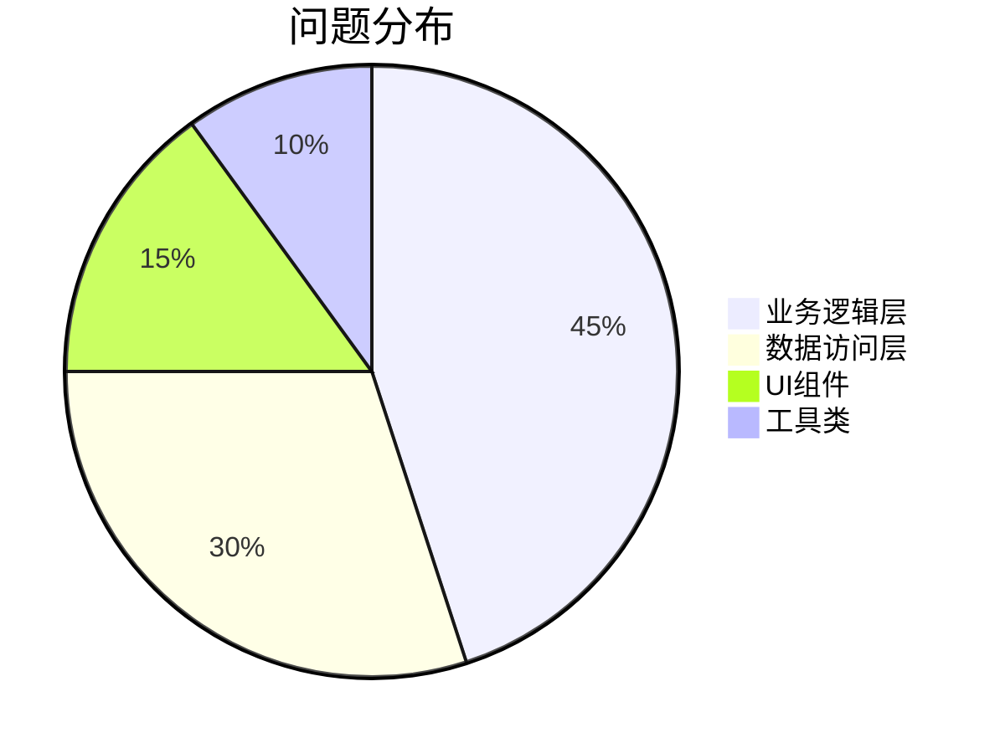

## 代码质量报告模板

### 1. 质量概览
```json
{
  "检测时间": "2023-11-15",
  "代码规模": {
    "文件数": 142,
    "行数": 18500
  },
  "质量评分": 87/100,
  "技术债务": "2d 4h"
}
```

### 2. 问题分类
| 类型       | 数量 | 严重程度 | 示例 |
|------------|------|----------|------|
| Code Smell | 32   | ⚠️ Major | 过长方法（>50行） |
| 安全漏洞   | 2    | ❌ Critical | SQL注入风险 |
| 代码重复   | 15   | ⚠️ Minor | 相似代码块（相似度85%） |
| 测试缺陷   | 7    | ⚠️ Major | 单元测试覆盖率不足（当前75%） |

### 3. 热点分析


---

## 分析问题及解决

### 步骤1：问题发现与记录
1. **创建问题卡片**：
   - 进入仓库「Issues」页面
   - 点击「New issue」选择「缺陷报告」模板
   - 填写完整信息后提交

2. **标记严重程度**：
   - 在Issue右侧添加标签：
     - 🔴 Critical（系统崩溃/数据丢失）
     - 🟠 Major（核心功能失效）
     - 🟡 Minor（非关键问题）

### 步骤2：建立回溯任务
1. **生成分析看板**：
   - 在Issue评论区输入 `/todo` 创建任务清单：
   ```
   /todo
   - [ ] 根本原因分析
   - [ ] 影响范围确认
   - [ ] 修复方案设计
   - [ ] 预防措施制定
   ```

2. **关联相关提交**：
   - 找到导致问题的代码提交记录（Commit）
   - 在Commit信息末尾添加 `#Issue编号`（例如 `#45`）

### 步骤3：执行5Why分析
1. **安装分析工具**：
   - 在Issue评论区输入 `/why5` 启动模板
   ```
   /why5
   问题现象：______
   第1次为什么：______
   第2次为什么：______
   第3次为什么：______
   第4次为什么：______
   根本原因：______
   ```

2. **填写分析过程**（示例）：
   ```
   问题现象：用户支付失败
   第1次为什么：支付接口返回500错误
   第2次为什么：数据库连接超时
   第3次为什么：连接池配置过小
   第4次为什么：未进行压力测试
   根本原因：缺少性能测试环节
   ```

### 步骤4：制定改进措施
1. **创建改进任务**：
   - 在Issue中点击「Convert to discussion」转为技术讨论
   - 在讨论区使用决策矩阵：

   | 方案选项 | 实施成本 | 效果预期 | 选择结果 |
   |----------|----------|----------|----------|
   | 增加自动化测试 | 中 | 高 | ✅ 采用 |
   | 修改配置参数 | 低 | 中 | ➖ 临时方案 |

2. **生成改进卡片**：
   - 点击「Add cards」将决策结果添加到「质量回溯看板」

---

## 质量门禁配置

## 一、配置入口：GitHub Actions
所有检测工具均需通过 GitHub Actions 工作流实现自动化检查，配置步骤如下：

### 1. 创建工作流文件
1. 进入 GitHub 仓库页面 → 点击 `.github/workflows` 文件夹（若没有则新建）  
2. 点击 `Add file` → `Create new file`  
3. 输入文件名 `quality-gate.yml`  
4. 粘贴以下基础模板：
```yaml
name: Quality Gate
on: [push, pull_request]

jobs:
  quality-check:
    runs-on: ubuntu-latest
    steps:
      # 后续步骤在此添加检测工具
```

## 二、4 种检测工具配置方法

### 1. **ESLint（代码规范检查）**
```yaml
- name: ESLint Check
  uses: actions/setup-node@v3
  with:
    node-version: 18.x
- run: npm install eslint --save-dev
- run: npx eslint .
```
**配置说明**：
- 需在项目根目录添加 `.eslintrc` 配置文件（可通过 `npx eslint --init` 生成）
- 规则示例：禁止未使用的变量
```json
{
  "rules": {
    "no-unused-vars": "error"
  }
}
```

### 2. **Jest（单元测试与覆盖率）**
```yaml
- name: Jest Test
  uses: actions/setup-node@v3
  with:
    node-version: 18.x
- run: npm install jest --save-dev
- run: npx jest --coverage
```
**阈值设置**（在 `package.json` 中）：
```json
{
  "jest": {
    "coverageThreshold": {
      "global": {
        "branches": 85,
        "functions": 85,
        "lines": 85,
        "statements": 85
      }
    }
  }
}
```

### 3. **Snyk（安全漏洞扫描）**
```yaml
- name: Snyk Security
  uses: snyk/actions/node@master
  with:
    command: test
  env:
    SNYK_TOKEN: ${{ secrets.SNYK_TOKEN }}
```
**操作步骤**：
1. 注册 [Snyk 官网](https://snyk.io/) 获取 API Token  
2. 在 GitHub 仓库的 `Settings → Secrets → Actions` 中添加 `SNYK_TOKEN`  
3. 自动扫描代码依赖项漏洞

### 4. **SonarCloud（代码质量分析）**
```yaml
- name: SonarCloud Scan
  uses: sonarsource/sonarcloud-github-action@master
  env:
    GITHUB_TOKEN: ${{ secrets.GITHUB_TOKEN }}
    SONAR_TOKEN: ${{ secrets.SONAR_TOKEN }}
```
**配置流程**：
1. 关联 SonarCloud 账号（需 GitHub 授权）  
2. 在 SonarCloud 创建项目 → 获取 `SONAR_TOKEN`  
3. 将 Token 添加到 GitHub Secrets（同 Snyk 步骤）


## 三、设置质量门禁规则
### 1. 分支保护规则
1. 进入仓库 `Settings → Branches → Add rule`  
2. 输入分支名（如 `main`） → 勾选：
   - ✅ Require status checks to pass before merging  
   - ✅ ESLint Check / Jest Test / Snyk Security / SonarCloud Scan  
3. 点击 `Save changes`

### 2. 失败处理示例
若检测未通过，GitHub 会阻止代码合并并显示错误详情


## 四、常见问题解答
1. **如何查看检测报告？**  
   - ESLint/Jest：在 Actions 标签页查看具体报错行  
   - Snyk/SonarCloud：点击检测步骤中的 `Details` 跳转到官网报告  

2. **工具配置失败怎么办？**  
   - 检查 YAML 缩进是否正确（必须使用空格）  
   - 确认 Secrets 中的 Token 已正确添加  

3. **如何调整严格度？**  
   - ESLint：修改 `.eslintrc` 中的 `rules` 等级（"off"/"warn"/"error"）  
   - Jest：调整 `coverageThreshold` 百分比  

> 提示：建议先在本机运行 `npm run test` 本地验证，再推送代码至 GitHub。