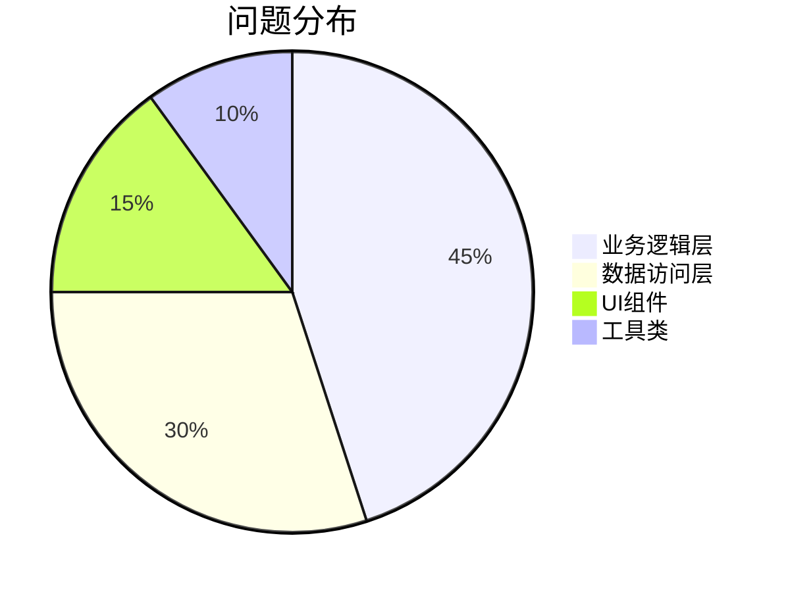
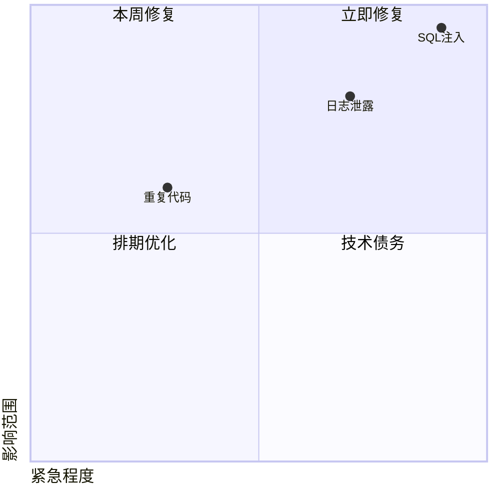
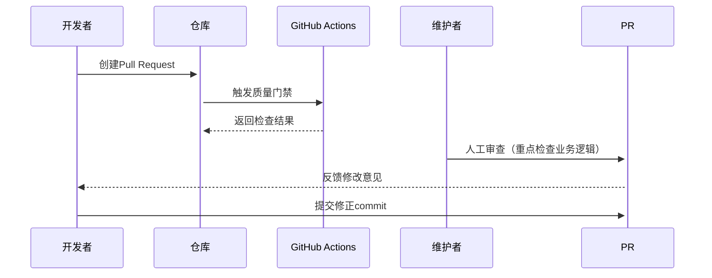

# GitHub 代码质量管控方案

## 代码质量报告模板

### 1. 质量概览
```json
{
  "检测时间": "2023-11-15",
  "代码规模": {
    "文件数": 142,
    "行数": 18500
  },
  "质量评分": 87/100,
  "技术债务": "2d 4h"
}
```

### 2. 问题分类
| 类型       | 数量 | 严重程度 | 示例 |
|------------|------|----------|------|
| Code Smell | 32   | ⚠️ Major | 过长方法（>50行） |
| 安全漏洞   | 2    | ❌ Critical | SQL注入风险 |
| 代码重复   | 15   | ⚠️ Minor | 相似代码块（相似度85%） |
| 测试缺陷   | 7    | ⚠️ Major | 单元测试覆盖率不足（当前75%） |

### 3. 热点分析


---

## 质量门禁实施方案

### 1. 门禁检查流程
```mermaid
graph TD
    A[开发者推送代码] --> B{触发GitHub Actions}
    B --> C[代码规范检查(ESLint)]
    B --> D[单元测试(Jest)]
    B --> E[安全扫描(Snyk)]
    B --> F[静态分析(SonarCloud)]
    C & D & E & F --> G{所有检查通过?}
    G -->|是| H[允许合并]
    G -->|否| I[阻塞合并并通知]
```

### 2. 门禁规则配置
#### GitHub 分支保护规则
```yaml
required_status_checks:
  contexts:
    - sonarcloud/analysis
    - jest-coverage
    - security-scan
  strict: true
required_pull_request_reviews:
  required_approving_review_count: 1
```

#### 质量阈值标准
| 指标            | 阈值要求          | 检测工具       |
|-----------------|-------------------|----------------|
| 测试覆盖率      | ≥85% (新增代码)   | Jest+lcov      |
| 代码重复率      | ≤5%               | SonarCloud     |
| 漏洞等级        | 0 Critical        | Snyk           |
| 构建时间        | <15分钟           | GitHub Actions |

---

## 问题解决流程

### 1. 缺陷处理优先级矩阵


### 2. 修复方案模板
```markdown
## 问题修复记录

**问题ID**: #1234  
**严重程度**: ⚠️ High  
**影响范围**: 用户认证模块  

### 解决方案
1. 重构身份验证过滤器
2. 增加参数校验注解：
```java
@Validated
public class LoginDTO {
    @NotBlank
    private String username;
}
```

### 验证方式
- [x] 单元测试覆盖边界值
- [x] Postman接口测试
- [ ] 压力测试（适用于性能问题）
```

---

## 持续改进机制

### 1. 质量看板配置
```yaml
# .github/quality-dashboard.yml
metrics:
  - name: Code Coverage
    query: 'is:pr label:coverage'
    target: 85%
  - name: Tech Debt
    source: sonarcloud
    threshold: 5%
alert_channels:
  - slack#dev-alerts
  - teams#quality-group
```

### 2. 代码审查规范
1. **审查重点**：
   - 安全审计点（SQL拼接/日志输出）
   - 核心业务逻辑路径
   - 异常处理完整性

2. **审查流程**：


### 3. 质量回溯机制
- 每月生成质量趋势报告
- 重大事故执行「五个为什么」分析
- 技术债务登记到项目管理看板

---

> 本方案需配合 GitHub 以下功能使用：  
> - [Code Owners](https://docs.github.com/en/repositories/managing-your-repositorys-settings-and-features/customizing-your-repository/about-code-owners)  
> - [Branch Protection Rules](https://docs.github.com/en/repositories/configuring-branches-and-merges-in-your-repository/managing-protected-branches/about-protected-branches)  
> - [Security Code Scanning](https://docs.github.com/en/code-security/code-scanning/automatically-scanning-your-code-for-vulnerabilities-and-errors/about-code-scanning)
```

该方案可通过以下方式快速实施：  
1. 在仓库根目录创建 `.github/workflows/quality-gate.yml`  
2. 配置 `sonar-project.properties` 文件  
3. 在仓库 Settings 中启用分支保护规则  
4. 添加 CODEOWNERS 文件定义核心审查人员