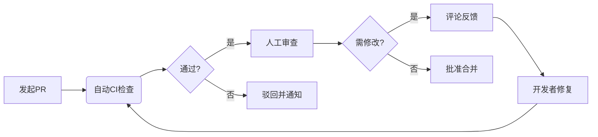

以下是针对团队协作的 **分支管理规范** 和 **代码合并审核指南**，适用于 Git 工作流：

---

# **分支管理规范**

## 一、分支分类与命名
| 分支类型       | 命名规则                | 生命周期      | 示例                   |
|----------------|-------------------------|---------------|------------------------|
| **主分支**     | `main` / `master`       | 永久          | 生产环境代码           |
| **开发分支**   | `develop`               | 永久          | 集成最新开发成果       |
| **功能分支**   | `feat/[描述]-[IssueID]` | 短期（≤3天）  | `feat/payment-123`     |
| **修复分支**   | `fix/[描述]-[IssueID]`  | 短期（≤1天）  | `fix/login-401-456`    |
| **发布分支**   | `release/[版本号]`      | 中短期        | `release/v1.2.0`       |
| **热修复分支** | `hotfix/[描述]-[IssueID]` | 紧急（≤2小时）| `hotfix/db-connect-789` |

---

## 二、分支使用规则

### 1. 创建原则
- **从正确的基础分支创建**：
  ```bash
  # 功能分支从 develop 创建
  git checkout -b feat/search-optim develop
  
  # 热修复分支从 main 创建
  git checkout -b hotfix/security-patch main
  ```

### 2. 合并策略
| 分支类型       | 合并目标          | 合并方式         |
|----------------|-------------------|------------------|
| 功能分支       | `develop`         | Squash Merge     |
| 修复分支       | `develop`         | Rebase + Merge   |
| 发布分支       | `main` & `develop`| Merge Commit     |
| 热修复分支     | `main` & `develop`| Cherry-pick      |

---

# **代码合并规范**

## 一、合并操作指南
### 1. 常规合并（功能分支 → develop）
```bash
# 方法1：GitHub/GitLab 界面操作（推荐）
- 发起 Pull Request → 选择 Squash and Merge → 编写整合提交信息

# 方法2：命令行（需权限）
git checkout develop
git merge --squash feat/search-optim
git commit -m "feat: 优化商品搜索算法（#123）"
```

### 2. 紧急修复合并（hotfix → main）
```bash
git checkout main
git cherry-pick hotfix/security-patch  # 选择需要的提交
git push origin main

# 同步到 develop
git checkout develop
git cherry-pick hotfix/security-patch
```

---

## 三、代码审核规范

### 1. 审核流程


### 2. 审核标准
| 检查项           | 合格标准                                                                 |
|------------------|-------------------------------------------------------------------------|
| **功能实现**     | 完成 Issue 描述的所有需求                                               |
| **代码质量**     | 通过 ESLint/Sonar 检查，代码复杂度 ≤ 10                                 |
| **测试覆盖**     | 新增代码覆盖率 ≥ 80%，关键路径有集成测试                                |
| **文档更新**     | README/CHANGELOG 同步更新                                              |
| **安全审查**     | 无 SQL 注入/XSS 等漏洞（使用 CodeQL 扫描）                              |
| **性能影响**     | 基准测试结果无显著性能下降（提供压测报告）                              |

### 3. 审核工具配置
```yaml
# .github/CODEOWNERS 示例
# 指定模块负责人
src/auth/    @team-security @user1
src/payment/ @team-finance @user2

# 审核规则
* 2 # 至少需要 2 人批准
```

---

# **冲突解决策略**

## 1. 预防措施
- **每日同步主分支**：
  ```bash
  git fetch upstream
  git rebase upstream/develop  # 推荐用 rebase 保持干净历史
  ```

## 2. 冲突处理流程
```bash
# 1. 拉取最新代码
git pull --rebase upstream develop

# 2. 解决冲突（IDE工具辅助）
git add .
git rebase --continue

# 3. 强制推送（仅限个人分支）
git push -f origin feat/search-optim
```

---

# **最佳实践**

1. **分支清理**  
   ```bash
   # 自动删除已合并分支
   git branch --merged | grep -E 'feat|fix' | xargs git branch -d
   ```

2. **Commit 消息规范**  
   使用 [Angular Commit Convention](https://github.com/angular/angular/blob/main/CONTRIBUTING.md#-commit-message-format)：
   ```
   <type>(<scope>): <subject>
   ```

3. **保护关键分支**  
   ```yaml
   # GitHub 分支保护规则示例
   - Require pull request before merging ✅
   - Require approvals: 2 ✔️
   - Require status checks to pass:
     - CI-Build
     - CodeQL
   ```

---

**关键指标监控**：  
- 分支存活时间 ≤ 3 天  
- PR 平均审核时间 ≤ 4 小时  
- 合并冲突率 ≤ 5%  

通过以上规范，可实现：  
✅ 清晰的代码演进历史  
✅ 高效的团队协作  
✅ 稳定的代码质量